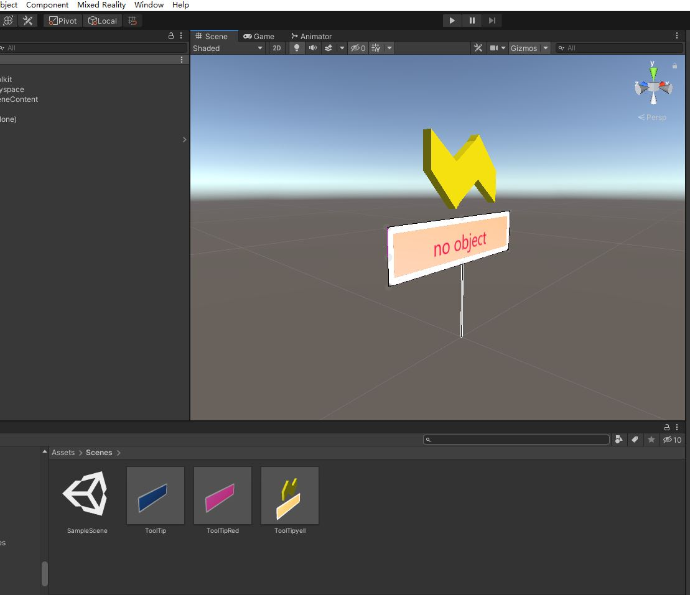
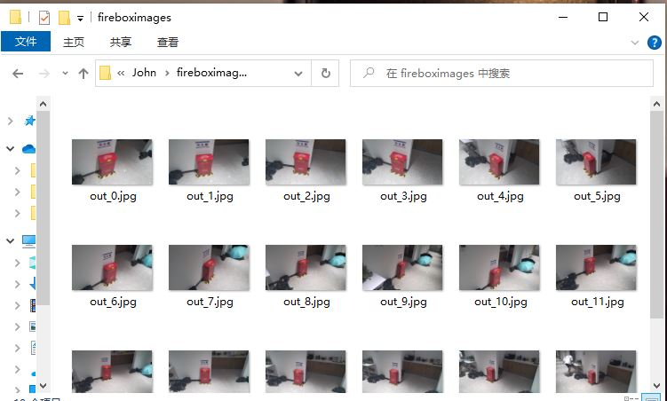
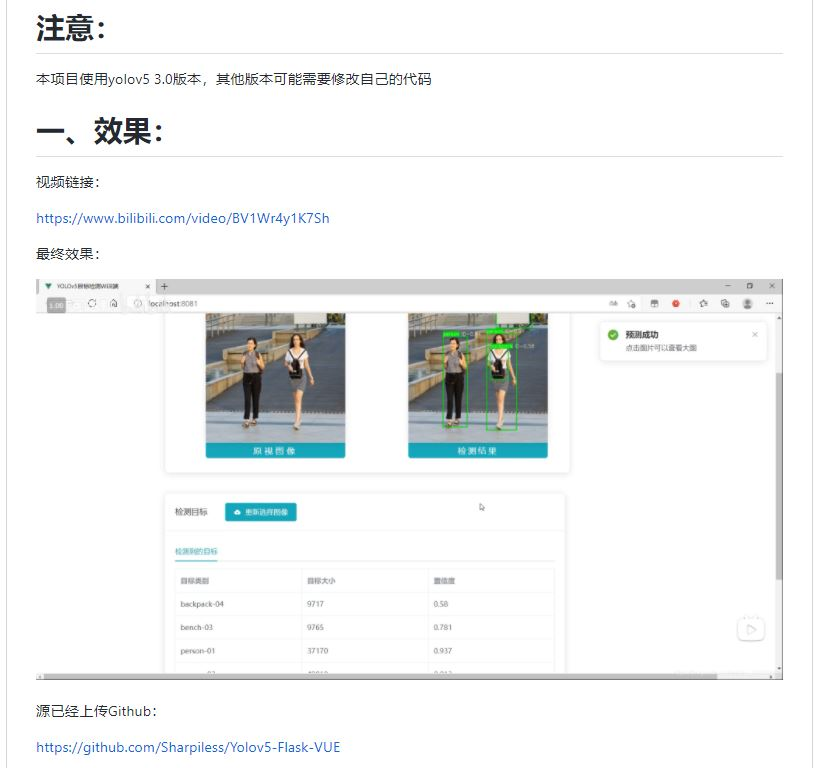

# 第十二周组会汇报
## Hololens 示例场景

### 一、根据ocr的检测结果对客户端和服务器进行适配开发
#### （1）服务器端，根据ocr检测返回的列表，遍历选择含有对应的字符的项，再遍历这些项选择在视野中的最明显的，选择其作为目标
#### （2）制作相应的预制件，进行配套提醒

 
#### （3）yolo+ocr 进行基本整合，实现检测
#### （4）准备相关数据集

### 二.http上传服务器，上传至后端flask
#### 1.了解flask - vue 前后端分离

#### 2.已经构建新的客户端HoloLens程序，实现http传输图片至服务器，后续继续将前面的工作迁移到该程序

#自学内容
1.计算机科普系列https://www.bilibili.com/video/BV1EW411u7th
    机械→机电→电子
    bug的由来
    ALU 半加器全加器
    RAM 寄存器抽象
    cpu control unit (alu ram)
    软件：汇编器 编译器（高级语言 ）

2.mathematics for computer science整理

3.根据北大助教github项目明确学习资源 MIT UC
    数学：
        信息论 informaation theory and entropy 
        离散数学和概率论 UCB CS70 : discrete Math and
        probability theory 和 UCB CS126 : Probability theory 
        数值分析 computationalThingking

4. 黑马c++ 配置linux xd3
5. 英语计算机早期历史
