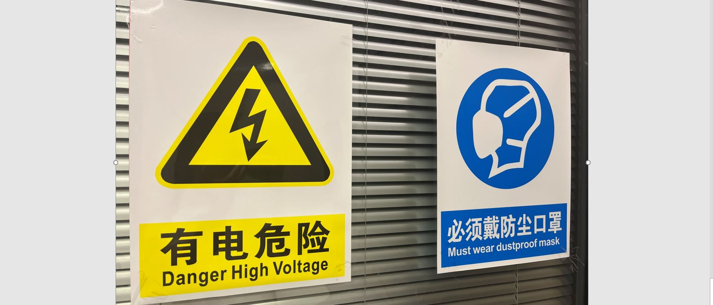
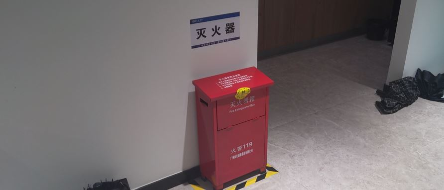
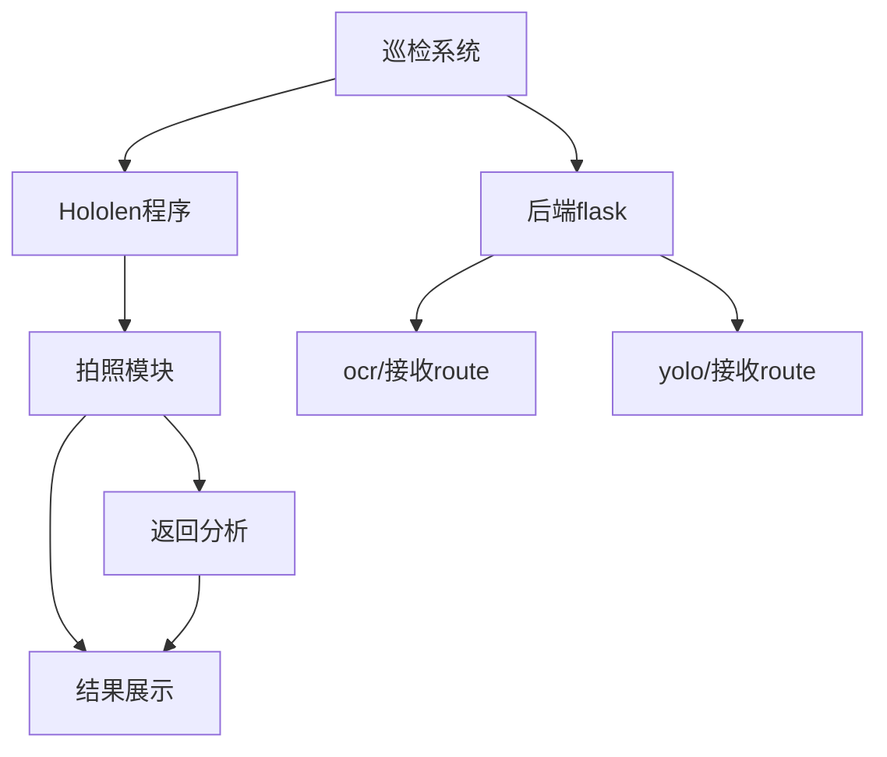
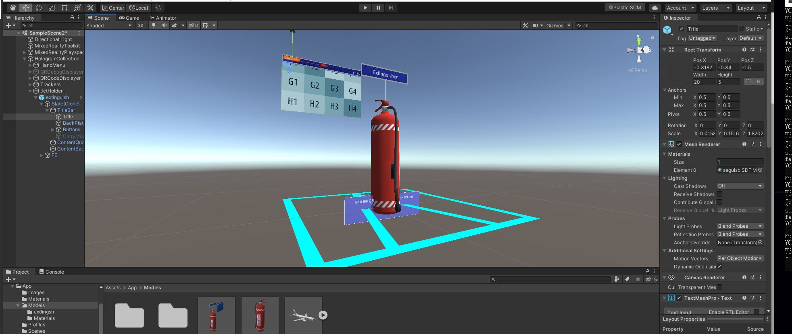

## 一、yolov5与ocr 自定义识别程序

#### 1.将前面的结果显示的方式迁移至http传输的后端,实现自动连续发送图片且不阻塞线程。
#### 2.导入闪电、警示牌的模型，以便之后识别完成强调提醒。
#### 3.使用OCR检测到灭火器的字样后，自动进入识别灭火的阶段 采用设定时间间隔的发送的方式。

## 二、QR code识别 展示设定模型预及视频程序
#### 1.学习使用二维码识别，以及slate(面板)控件的视频导入与展示

#### 2.学习使用HoloLens 空间锚点和场景保持功能