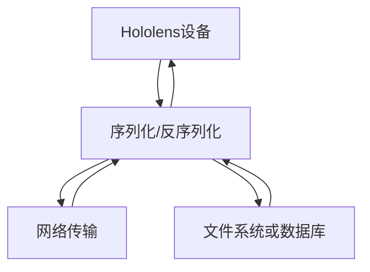
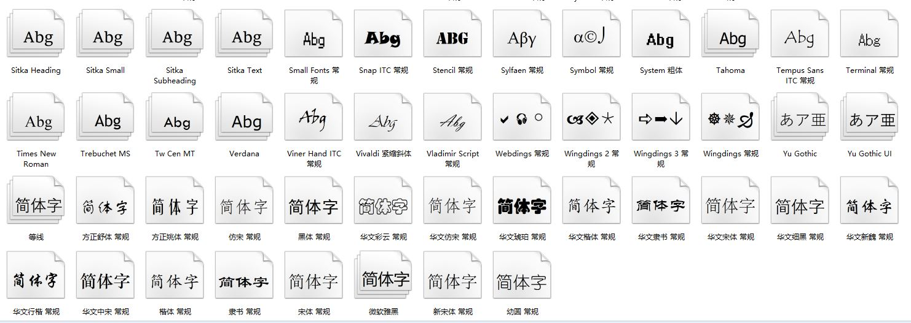

## Hololens 安全演示场景
### 空间锚点和场景保持
**解决的问题:** 应用运行中的数据不能持久化保存。在应用启动后所检测的空间环境、加载的虚拟物体、设备姿态等都会在应用关闭后丢失。

**安全巡检的场景中:** 这时更希望应用能保存当前状态，构建确定的虚拟物体场景，在下一次进入时能恢复到中断前的状态，接着进行下一步操作而不是从头再来，或者希望能与别人一起共享MR体验而不仅局限于本机

**1.锚点：** 锚点的原意是指不让船舶漂移的固定锚，在这里指的是AR/MR空间上的一种技术。由于跟踪所使用的IMU传器特点，误差会随着时间积累所以需要通过视觉检测技术修正误差，此时，如果已存在于空间中的虚拟对象不进行同步机正则会出现偏差，锚点的功能即是绑定虚拟物体与MR空间位置。被赋予锚点的对象将被视为固定在空间上的特定位置，并自动进行位置校正，锚点可以确保物体在空间中看起来化持相同的位置和方向，将虚拟物体固定在AR/MR 场景中。
**2.原理：** 通过计算机视觉计算可以消除IMU运动跟踪差，从而将锚点保持在空间中相同的位置与方向，这样，连接到该锚点的虚拟对象也就不出现漂移。锚点空间点的位置信息，通过环境扫描还保存了场景特征点云的信息。保存了一个锚点上可以连接一个或多个虚拟对象，锚点和连接到它上面的物体看起来保持它们在现实世界中的放置位置，随着锚点姿态在每帧中进行调整以适应现实世界空间更新.

### Hololens TMP导入中文字体

### 场景搭建及改进