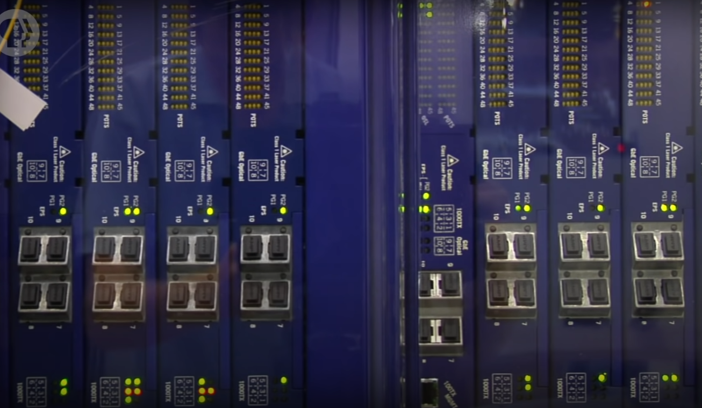
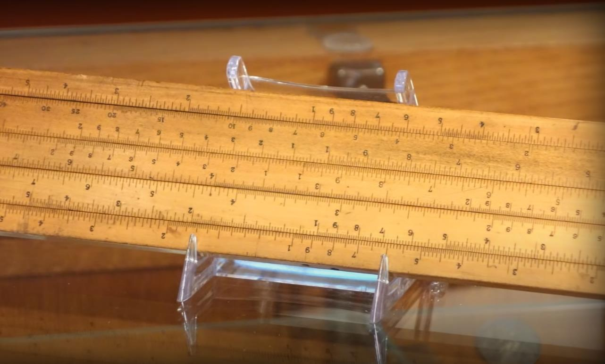
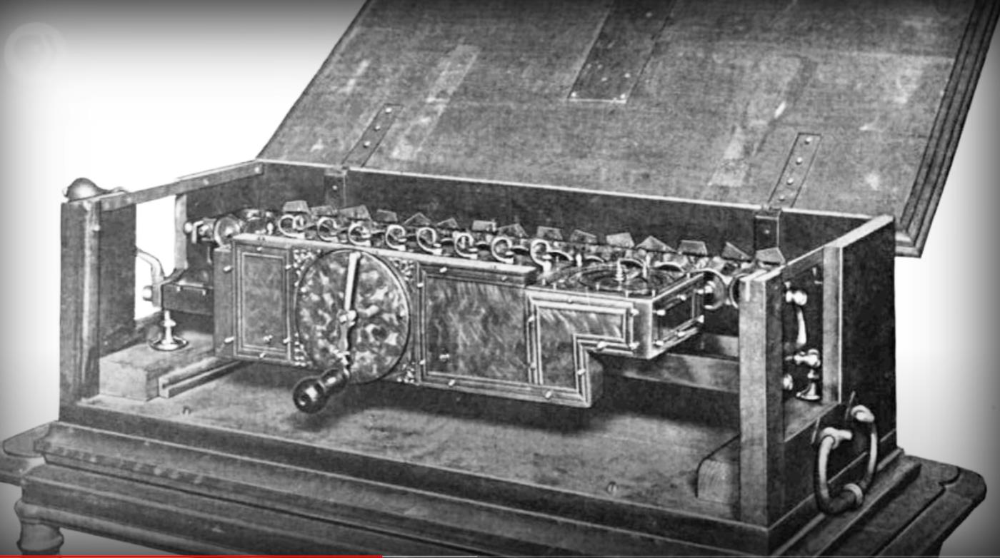
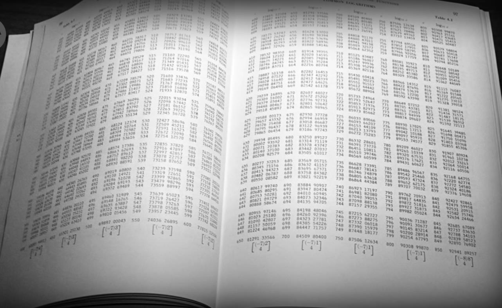
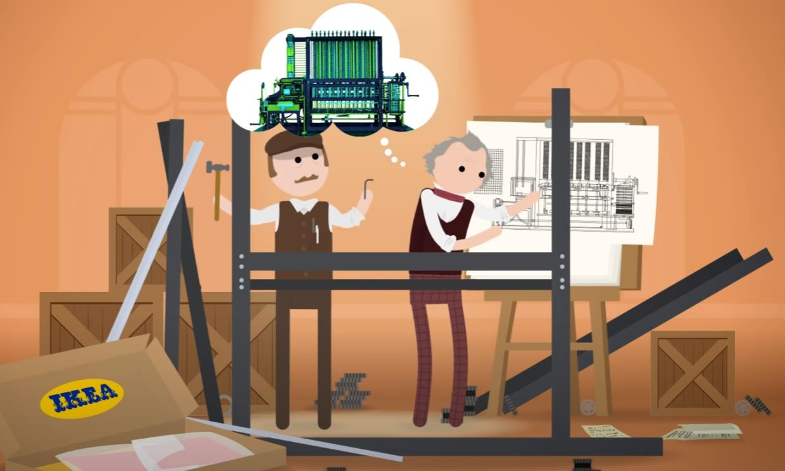
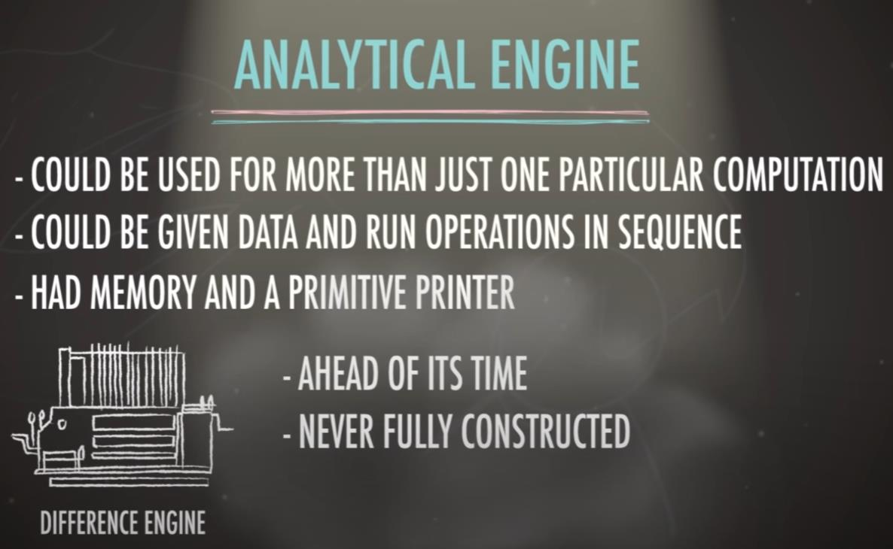
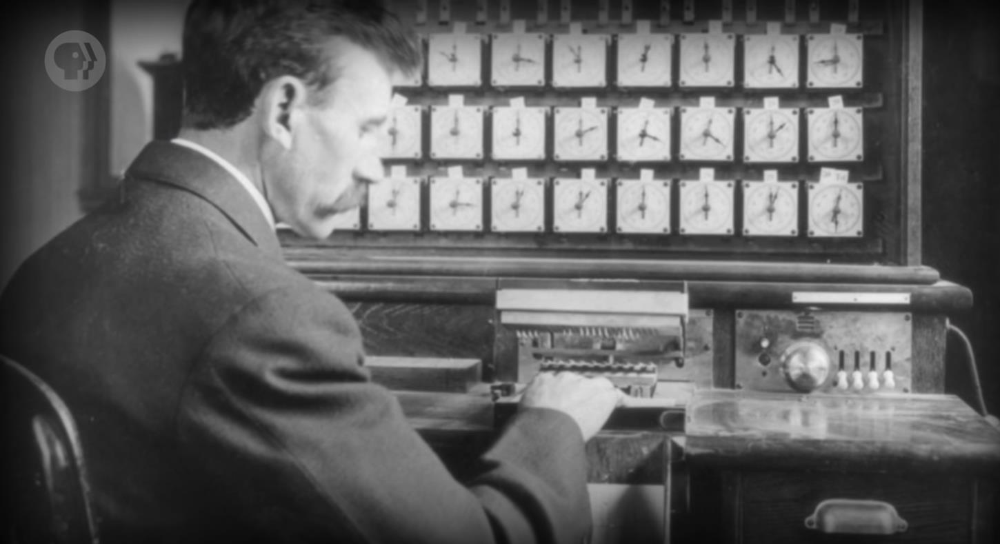
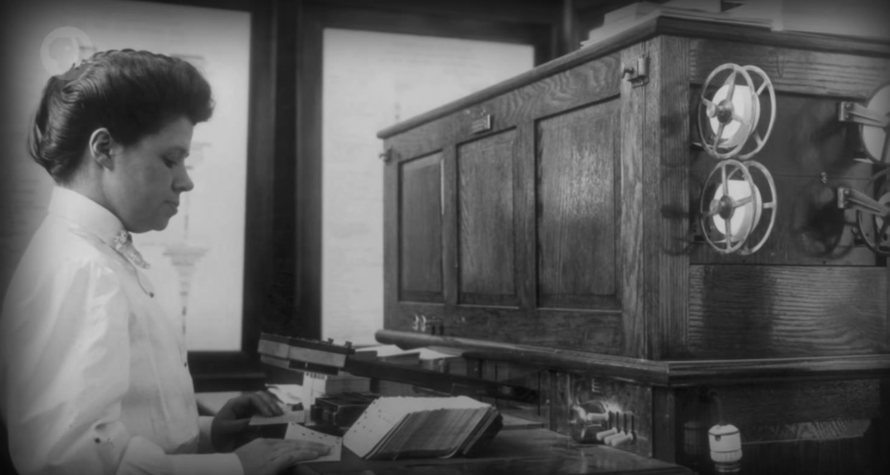

# English presentation

Computers are the lifeblood of today's world.
计算机是当今世界的命脉
If they were to suddenly turn off, all at once,
如果突然关掉所有的计算机
the power grid would shut down, cars would crash, planes would fall,
电网会关闭，车辆会相撞，飞机会坠毁
water treatment plants would stop, stock markets would freeze,
净水厂会关闭，证券市场会停止运作
trucks with food wouldn't know where to deliver, and employees wouldn't get paid.
装满食物的卡车不知运往何方，员工得不到薪水
Even many non-computer objects
甚至很多和计算机无关的东西，
are made in factories run by computers.
也都是在计算机管理的工厂中制造的

Computing really has transformed nearly every aspect of our lives.
计算机改变了我们生活中几乎所有方面
And with billions of transistors in just your smartphones, computers can seem pretty complicated,
你的智能手机中有数十亿个晶体管，看起来好像很复杂
but really, they're just simple machines
但实际上它是很简单的机器
that perform complex actions through many layers of abstraction.
通过一层层的抽象  来做出复杂操作

c

Over the next 4000 years, humans developed all sorts of clever computing devices,
在接下来 4000 年，人类发明了各种巧妙的计算设备
like the astrolabe, which enabled ships to calculate their latitude at sea.
比如星盘，让船只可以在海上计算纬度
.jpg)
Or the slide rule, for assisting with multiplication and division.
或计算尺，帮助计算乘法和除法

And there are literally hundred of types of clocks created
人们还创造了上百种
that could be used to calculate sunrise, tides, positions of celestial bodies, and even just the time.
算日出，潮汐，天体的位置，或纯粹拿来计时
Each one of these devices made something that was previously laborious to calculate much faster,
这些设备让原先很费力的事变得更快，更简单，更精确
easier, and often more accurate
这些设备让原先很费力的事变得更快，更简单，更精确
- it lowered the barrier to entry,
降低了门槛
and at the same time, amplified our mental abilities -
加强了我们的能力

However, none of these devices were called "computers".
然而，这些设备那时都不叫 "计算机"

The earliest documented use of the word "computer" is from 1613, in a book by Richard Braithwait.
最早使用 "计算机" 一词的文献 来自 1613 年的一本书，作者 Richard Braithwait
And it wasn't a machine at all - it was a job title.
然而指的不是机器，而是一种职业
Braithwait said,
Braithwait 说：
"I have read the truest computer of times,
"我听说过的计算者里最厉害的，能把好几天的工作量大大缩减"
and the best arithmetician that ever breathed, and he reduceth thy dayes into a short number".
"我听说过的计算者里最厉害的，能把好几天的工作量大大缩减"
In those days, computer was a person who did calculations,
那时, "Computer" 指负责计算的人
sometimes with the help of machines, but often not.
"Computer" 偶尔会用机器帮忙，但大部分时候靠自己
This job title persisted until the late 1800s,
这个职位一直到 1800 年代还存在

when the meaning of computer started shifting to refer to devices.
之后 "Computer" 逐渐开始代表机器

Notable among these devices was the Step Reckoner,
其中"步进计算器"最有名
built by German polymath Gottfried Leibniz in 1694.
由德国博学家 戈特弗里德·莱布尼茨 建造于 1694 年
Leibniz said "... it is beneath the dignity of excellent men to waste their time in calculation
莱布尼茨说过 "... 让优秀的人浪费时间算数简直侮辱尊严
when any peasant could do the work just as accurately with the aid of a machine."
农民用机器能算得一样准"
It worked kind of like the odometer in your car,
"步进计算器"有点像汽车里的里程表，不断累加里程数
which is really just a machine for adding up the number of miles your car has driven.
"步进计算器"有点像汽车里的里程表，不断累加里程数
The device had a series of gears that turned;
它有一连串可以转动的齿轮
each gear had ten teeth, to represent the digits from 0 to 9.
每个齿轮有十个齿，代表数字0到9
Whenever a gear bypassed nine, it rotated back to 0 and advanced the adjacent gear by one tooth.
每当一个齿轮转过 9，它会转回 0，同时让旁边的齿轮前进 1 个齿
Kind of like when hitting 10 on that basic abacus.
就像算盘超过 10 一样.
This worked in reverse when doing subtraction, too.
做减法时，机器会反向运作.
It was the first machine that could do all four of these operations.
它是第一台能做"加减乘除"全部四种运算的机器 
And this design was so successful it was used for the next three centuries of calculator design.
它的设计非常成功，以至于沿用了 3 个世纪.
Unfortunately, even with mechanical calculators,
不幸的是，即使有机械计算器
most real world problems required many steps of computation before an answer was determined.
许多现实问题 依然需要很多步
It could take hours or days to generate a single result.
算一个结果可能要几小时甚至几天
Also, these hand-crafted machines were expensive, and not accessible to most of the population.
而且这些手工制作的机器非常昂贵，大部分人买不起
So, before 20th century,
所以在 20 世纪以前
most people experienced computing through pre-computed tables
大部分人会用预先算好的计算表

assembled by those amazing "human computers" we talked about.
这些计算表由之前说的 "人力计算器" 编撰
So if you needed to know the square root of 8 million 6 hundred and 75 thousand 3 hundred and 9,
如果你想知道 867,5309 的平方根

instead of spending all day hand-cranking your step reckoner,
与其花一整天来手摇 "步进计算器"
you could look it up in a huge book full of square root tables in a minute or so.
你可以花一分钟在表里找答案
Speed and accuracy is particularly important on the battlefield,
速度和准确性在战场上尤为重要
and so militaries were among the first to apply computing to complex problems.
因此军队很早就开始用计算解决复杂问题
A particularly difficult problem is accurately firing artillery shells,
如何精确瞄准炮弹是一个很难的问题
which by the 1800s could travel well over a kilometer (or a bit more than half a mile).
19世纪，这些炮弹的射程可以达到 1 公里以上（比半英里多一点）
Add to this varying wind conditions, temperature, and atmospheric pressure,
因为风力，温度，大气压力会不断变化
and even hitting something as large as a ship was difficult.
想打中船一样大的物体也非常困难
Range Tables were created that allowed gunners to look up environmental conditions
于是出现了射程表，炮手可以查环境条件和射击距离
and the distance they wanted to fire,
于是出现了射程表，炮手可以查环境条件和射击距离
and the table would tell them the angle to set the canon.
然后这张表会告诉他们，角度要设成多少
These Range Tables worked so well, they were used well into World War Two.
这些射程表很管用，二战中被广泛应用
The problem was, if you changed the design of the cannon or of the shell,
问题是如果改了大炮或炮弹的设计，就要算一张新表
a whole new table had to be computed,
问题是如果改了大炮或炮弹的设计，就要算一张新表
which was massively time consuming and inevitably led to errors.
这样很耗时而且会出错
Charles Babbage acknowledged this problem in 1822
Charles Babbage 在 1822 年写了一篇论文
in a paper to the Royal Astronomical Society entitled:
向皇家天文学会指出了这个问题
"Note on the application of machinery to the computation of astronomical and mathematical tables".
标题叫： "机械在天文与计算表中的应用"
Charles Babbage proposed a new mechanical device called the Difference Engine,
Charles Babbage 提出了一种新型机械装置叫 "差分机"
a much more complex machine that could approximate polynomials.
一个更复杂的机器，能近似多项式.
Polynomials describe the relationship between several variables
多项式描述了几个变量之间的关系
- like range and air pressure, or amount of pizza Carrie Anne eats and happiness.
比如射程和大气压力，或者 Carrie Anne 要吃多少披萨才开心
Polynomials could also be used to approximate logarithmic and trigonometric functions,
多项式也可以用于近似对数和三角函数
which are a real hassle to calculate by hand.
这些函数手算相当麻烦
Babbage started construction in 1823,
Charles Babbage 在 1823 年开始建造差分机

Unfortunately, the project was ultimately abandoned.
不幸的是，该项目最终放弃了
But, in 1991,
但在 1991 年
historians finished constructing a Difference Engine based on Babbage's drawings and writings
历史学家根据 Charles Babbage 的草稿做了一个差分机
- and it worked!
而且它还管用！
But more importantly, during construction of the Difference Engine,
但更重要的是，在差分机的建造期间
Babbage imagined an even more complex machine - the Analytical Engine.

Charles Babbage 构想了一个更复杂的机器 - 分析机
Unlike the Difference Engine,
不像差分机，步进计算器 和以前的其他计算设备
Step Reckoner and all other computational devices before it
不像差分机，步进计算器 和以前的其他计算设备
- the Analytical Engine was a "general purpose computer".
分析机是 "通用计算机"
It could be used for many things, not just one particular computation;
它可以做很多事情，不只是一种特定运算
it could be given data and run operations in sequence;
甚至可以给它数据，然后按顺序执行一系列操作
it had memory and even a primitive printer.
它有内存 甚至一个很原始的打印机
Like the Difference Engine, it was ahead of its time, and was never fully constructed.
就像差分机，这台机器太超前了，所以没有建成
However, the idea of an "automatic computer"
然而，这种 "自动计算机" 的概念 
- one that could guide itself through a series of operations automatically,
-计算机可以自动完成一系列操作
was a huge deal, and would foreshadow computer programs.
是个跨时代的概念，预示着计算机程序的诞生
English mathematician Ada Lovelace wrote hypothetical programs for the Analytical Engine, saying,
英国数学家 Ada Lovelace 给分析机写了假想的程序，她说：
"A new, a vast, and a powerful language is developed for the future use of analysis."
"未来会诞生一门全新的，强大的，专为分析所用的语言"
For her work, Ada is often considered the world's first programmer.
因此 Ada 被认为是世上第一位程序员.

The Analytical Engine would inspire, arguably, the first generation of computer scientists,
分析机激励了（可以这么讲）第一代计算机科学家
who incorporated many of Babbage's ideas in their machines.
这些计算机科学家 \N 把很多 Charles Babbage 的点子融入到他们的机器
This is why Babbage is often considered the "father of computing".
所以 Charles Babbage 经常被认为是 "计算之父"

So by the end of the 19th century,
到了 19 世纪末
computing devices were used for special purpose tasks in the sciences and engineering,
科学和工程领域中的特定任务 会用上计算设备
but rarely seen in business, government or domestic life.
但公司，政府，家庭中很少见到计算设备
However, the US government faced a serious problem for its 1890 census
然而，美国政府在 1890 年的人口普查中面临着严重的问题
that demanded the kind of efficiency that only computers could provide.
只有计算机能提供所需的效率
The US Constitution requires that a census be conducted every ten years,
美国宪法要求 10 年进行一次人口普查
for the purposes of distributing federal funds, representation in congress, and good stuff like that.
目的是分配联邦资金，国会代表，等等
And by 1880s, the US population was booming, mostly due to immigration.
到 1880 年代，美国人口迅速增长，大部分因为移民
That census took seven years to manually compile
人口普查要七年时间来手工编制，等做完都过时了
and by the time it was completed, it was already out of date
人口普查要七年时间来手工编制，等做完都过时了

The Census bureau turned to Herman Hollerith, who had built a tabulating machine.
人口普查局找了 Herman Hollerith，他发明了打孔卡片制表机

His machine was "electro-mechanical"
他的机器是 "电动机械的"
- it used traditional mechanical systems for keeping count,
- 用传统机械来计数
like Leibniz's Step Reckoner - but coupled them with electrically-powered components.
结构类似莱布尼茨的乘法器，但用电动结构连接其他组件
Hollerith's machine used punch cards
Hollerith 的机器用打孔卡
which were paper cards with a grid of locations that can be punched out to represent data.
一种纸卡，上面有网格，用打孔来表示数据.
For example, there was a series of holes for marital status.
举个例子，有一连串孔代表婚姻状况
If you were married, you would punch out the married spot,
如果你结婚了，就在 "结婚" 的位置打孔
then when the card was inserted into Hollerith's machine, little metal pins would come down over the card
当卡插入 Hollerith 的机器时，小金属针会到卡片上
- if a spot was punched out, the pin would pass through the hole in the paper
-如果有个地方打孔了，针会穿过孔
and into a little vial of mercury, which completed the circuit.
泡入一小瓶汞，联通电路
This now completed circuit powered an electric motor,
电路会驱动电机
which turned a gear to add one, in this case, to the "married" total.
然后给 "已婚" 的齿轮 + 1
Hollerith's machine was roughly 10x faster than manual tabulations,
Hollerith 的机器速度是手动的 10 倍左右
and the Census was completed in just two and a half years
使人口普查在短短两年半内完成
- saving the census office millions of dollars.
给人口普查办公室省了上百万美元
Businesses began recognizing the value of computing,
企业开始意识到计算机的价值
and saw its potential to boost profits by improving labor- and data-intensive tasks,
可以提升劳动力以及数据密集型任务 来提升利润
like accounting, insurance appraisals, and inventory management.
比如会计，保险评估和库存管理等行业
To meet this demand, Hollerith founded The Tabulating Machine Company,
为了满足这一需求，Hollerith 成立了制表机器公司
which later merged with other machine makers in 1924
这家公司后来在 1924 年与其它机械制造商合并
to become The International Business Machines Corporation or IBM
成为了 "国际商业机器公司"，简称 IBM
- which you've probably heard of.
-你可能听过 IBM
These electro-mechanical "business machines" were a huge success, transforming commerce and government,
这些电子机械的 "商业机器" 取得了巨大成功，改变了商业和政府.
and by the mid-1900s, the explosion in world population and the rise of globalized trade
到了 1900 年代中叶，世界人口的爆炸和全球贸易的兴起
demanded even faster and more flexible tools for processing data,
要求更快，更灵活的工具来处理数据
setting the stage for digital computers,
为电子计算机的发展奠定了基础