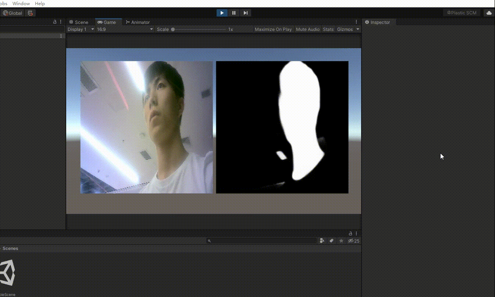

#### 人机交互作业
#### 数据科学入门
#### C++学习
#### 计算机crash course
#### Hololens演示程序
**一.定时器的使用**
**二.根据模型远近提示是否在恰当位置** 
1.进入程序,跟随菜单以及导航指引
    
2.指向固定好的虚拟场景
    
3.ocr文字识别到有电的标识牌，生成提示的预设虚拟物体

4.ocr文字识别到灭火器的标识牌，生成提示开始检测灭火器提示，并在灭火器的位置进行闪烁提醒

5.在检测到真实灭火器远离情况下，提示应正确放置

6.在检测到真实灭火器放置正确，则提示放置正确

**3.复现基于barracuda的unet和yolov2tiny网络本机推理**
1. HoloLens 2 上使用 Unity Barracuda 实现 U-2-Net 分割网络的测试项目。
    
2. TinyYOLOv2Barracuda是一个 Unity 示例项目，展示了如何 在 Unity Barracuda神经网络推理库上运行YOLO对象检测系统。
    
输入视频流中检测人物并将像素化效果应用于人物区域
    